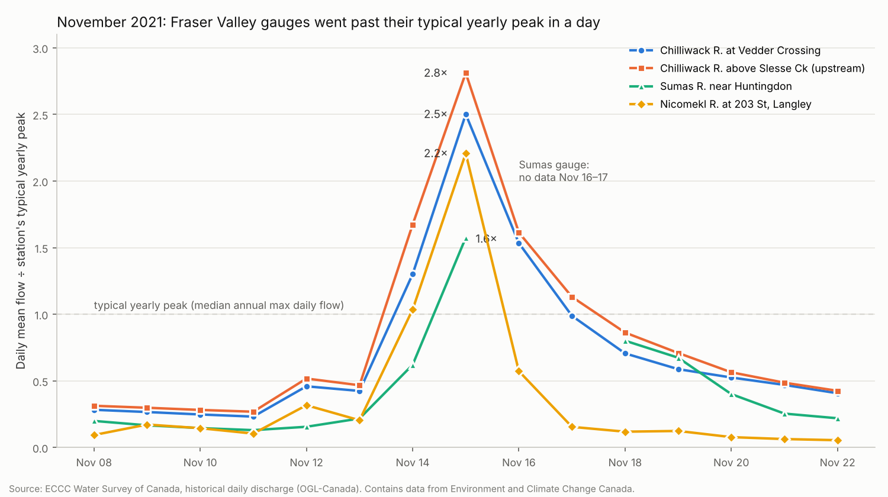

# FloodLead BC

**Hours of warning before *your* river gauge crosses *your* action level — and an agent that starts your plan when it does.**

FloodLead BC is a flood lead-time forecaster for BC farmers and riverside households. It turns the federal real-time hydrometric feed into a calibrated probability that a specific gauge will cross a level the user chose ("check pumps", "move cattle", "leave") within the next 6–48 hours. When the risk passes the user's own threshold, an agent calls them, waits for approval, and then texts the people on their action list. Every forecast is written to a public, hash-chained ledger and scored against what the river actually did.

> **Live app:** **https://34-130-109-216.sslip.io/** — Sumas Prairie overflow watch, station picker, replay of the 2021 and 2025 overflows · [API docs](https://34-130-109-216.sslip.io/docs) · [health](https://34-130-109-216.sslip.io/v1/health)
> **Brief:** [Brief (AI-drafted at the author's request)](brief.md)
> **Status:** Build Session 2 — working app (see [below](#build-session-2--working-app)). Datathon Season 2026, Trilemma Foundation × Northeastern University Vancouver.
> **Not an official warning service.** Always follow EmergencyInfoBC, the BC River Forecast Centre, NWS Seattle and your local authority's orders.

---

## One sentence

BC's flood advisories describe whole basins in cubic metres per second and return periods; FloodLead tells one farmer, in hours, when their gauge will reach the level at which they must act, and starts that action for them.

## Build Session 2 — working app

**Live:** https://34-130-109-216.sslip.io/ — a static app and a read-only API on one VM in Toronto, serving real data that is ingested continuously (ECCC every 5 min, USGS every 15 min, NOAA every 30 min).

### The idea, and the choices behind it

One real situation, end to end, with value the app already creates: **an atmospheric river is coming. Will the Nooksack spill over toward Sumas Prairie, as it did in November 2021 and December 2025 when it flooded farms and closed Highway 1, and how many hours would we have?**

- **The US gauges are core.** The water that floods Sumas Prairie comes over the Nooksack's overflow path at Everson, so the app watches USGS North Cedarville (12210700, with NOAA's official flood stages and forecast) and the Overflow at SR 544 gauge (12211195). BC gauges are all ingested too (442 stations).
- **Keep what disappears.** ECCC's real-time files only hold 30 days, so every raw payload is archived immutably (sha256-indexed) from Oct 7 ([D-01.7](docs/stages/STAGE-01-live-archive.md)).
- **Honest numbers only.** The replay below is computed from stored data by the API, not typed in. FloodLead's own forecasts are written to a hash-chained public ledger *before* the truth is known, and scored against persistence, trend and NOAA ([Stage 2 doc](docs/stages/STAGE-02-ledger-app.md)).
- **No build step.** A static page (`web/`), a pinned chart library vendored with its licence, a strict Content-Security-Policy and no third-party requests. A **snapshot mode** keeps the app usable offline.

### Data used (all real, all permitted)

| Source | What the app uses | Licence |
|---|---|---|
| USGS Water Data (OGC API v1; NWIS IV for history) | North Cedarville, Everson and Overflow at SR 544 levels: live, and 15-min history since 2007 | US public domain |
| NOAA NWS National Water Prediction Service | Official flood stages (action 144.8 / minor 146.5 / moderate 148 / major 150 ft) and the official 7-day forecast for North Cedarville (NRKW1), shown unmodified | US public domain (NWS conditions) |
| ECCC Water Survey of Canada (Datamart) | All real-time BC gauges in the station picker | Open Government Licence – Canada |

Full records: [`data-contract.md`](data-contract.md).

### Demo path (problem → action → visible result)

1. **Problem:** a storm is forecast; a farmer on Sumas Prairie wants to know whether the overflow is coming and how long they have.
2. **Action:** open the app → *Sumas Prairie overflow watch*:
   - see North Cedarville now against the official flood stages, with data time and age;
   - see NOAA's official forecast and FloodLead's baseline chances of crossing each stage within 6, 12, 24 and 48 h;
   - type a personal level and get the chance of reaching it, plus the earliest hour with ≥ 10 % and ≥ 50 % chance;
   - open the replay.
3. **Visible result:** the live distance to each stage, and from the replay how many hours the gauge gave before the overflow began:

| Event | Minor stage (146.5 ft) crossed | Overflow first record (SR 544) | Hours after minor | North Cedarville then | Peak at North Cedarville |
|---|---|---|---|---|---|
| 2015-11-13 ¹ | 2015-11-13 19:45Z | 2015-11-14 09:15Z (3.84 ft) | 13 h 30 min | 145.79 ft | 147.92 ft at 2015-11-14 02:45Z |
| 2015-11-18 | 2015-11-18 00:45Z | 2015-11-18 06:45Z (4.25 ft) | 6 h 00 min | 147.92 ft | 148.53 ft at 2015-11-18 04:00Z |
| 2016-01-28 | 2016-01-28 19:30Z | no overflow recorded | — | — | 147.18 ft at 2016-01-28 22:30Z |
| 2017-11-23 | 2017-11-23 13:00Z | 2017-11-23 19:25Z (3.97 ft) | 6 h 25 min | 147.60 ft | 148.13 ft at 2017-11-23 16:00Z |
| 2018-11-02 | 2018-11-02 15:30Z | no overflow recorded | — | — | 146.73 ft at 2018-11-02 15:45Z |
| 2018-11-27 | 2018-11-27 14:00Z | no overflow recorded | — | — | 147.04 ft at 2018-11-27 17:25Z |
| 2020-02-01 | 2020-02-01 11:45Z | 2020-02-01 16:55Z (4.13 ft) | 5 h 10 min | 148.44 ft | 148.85 ft at 2020-02-01 17:25Z |
| **2021-11-14** | **2021-11-14 21:30Z** | **2021-11-15 02:25Z (3.81 ft)** | **4 h 55 min** | **147.56 ft** | **150.76 ft at 2021-11-16 00:50Z** |
| 2021-11-28 | 2021-11-28 22:45Z | 2021-11-28 22:50Z (3.56 ft) | 0 h 05 min | 146.68 ft | 147.26 ft at 2021-11-29 03:15Z |
| 2022-11-05 | 2022-11-05 05:45Z | no overflow recorded | — | — | 146.93 ft at 2022-11-05 09:00Z |
| 2023-12-05 | 2023-12-05 18:15Z | no overflow recorded | — | — | 146.86 ft at 2023-12-05 19:00Z |
| 2024-01-28 | 2024-01-28 16:30Z | no overflow recorded | — | — | 147.30 ft at 2024-01-28 20:00Z |
| **2025-12-10** | **2025-12-10 20:15Z** | **2025-12-11 00:45Z (3.56 ft)** | **4 h 30 min** | **147.47 ft** | **150.44 ft at 2025-12-11 10:30Z** |
| 2026-03-20 | 2026-03-20 21:45Z | 2026-03-21 01:30Z (3.54 ft) | 3 h 45 min | 146.20 ft | 146.60 ft at 2026-03-20 22:15Z |

¹ The overflow gauge's record begins during this event, so it is left out of the summary.

**Summary** (from [`/v1/replay/overflow`](https://34-130-109-216.sslip.io/v1/replay/overflow); updated after supervisor QA on 2026-10-08):

- **The rule the data supports:** 7 of 13 minor-stage events since Nov 2015 were followed by water on the overflow path, a median **4.9 h later (0.1–6.4 h)**.
- **No single level separates overflow from no overflow:** peaks were 146.6–150.8 ft in events with an overflow and 146.7–147.3 ft in events without one. The ranges overlap.
- **The level at onset is not a trigger level:** it ranged 146.20–148.44 ft. In March 2026 the overflow first appeared on the falling limb, about 3 h after North Cedarville peaked at 146.6 ft.
- **The app's suggested personal level** is therefore the **official NWS minor flood stage, 146.5 ft**, together with that rule.

**Caveats:**
- This is approved historical data, not what was visible in real time.
- There are few events.
- Until 2026-10-01 the overflow gauge reported only while water was flowing, which is what makes its first record mean onset. It now reports continuously, so onset is taken as its first record ≥ 3.6 ft.
- The overflow path changes after big floods. The 2021-11-28 overflow began 5 min after minor stage, two weeks after the record flood.

The supervisor's independent figures for 2021 (4 h 55 min, 147.56–147.63 ft) and 2025 (4 h 30 min, 147.47–147.53 ft) agree. The Dec 2025 peak is a plateau (150.44 ft from 10:30Z to 11:00Z): the API reports when it was first reached.

### Run it locally

```bash
# 1. Snapshot mode: no setup, real data recorded from the live API (banner shows the snapshot time)
python3 -m http.server -d web 8080          # → http://localhost:8080

# 2. Full stack on a machine with Docker (needs a .env: PUBLIC_HOSTNAME, POSTGRES_PASSWORD, ARCHIVE_DIR)
docker compose up -d                         # db, ingest, api, caddy (+ backfills: see "Run it" below)
uv run floodlead export-demo                 # refresh web/data/snapshot/ from the database
```

### Check the forecasts yourself

Every FloodLead forecast is fixed in a public, hash-chained ledger **before** the river reaches it, and published hourly to the [`ledger` branch](https://github.com/agenticraptor/trilemma-datathon-FloodLeadBC/tree/ledger). Spec: [`docs/ledger-spec.md`](docs/ledger-spec.md).

```bash
python3 scripts/verify_ledger.py --api https://34-130-109-216.sslip.io   # verify the chain via the API (stdlib only)
python3 scripts/verify_ledger.py --source github                         # verify from the published files alone
uv run python scripts/reproduce_forecast.py --api https://34-130-109-216.sslip.io --n 3   # recompute forecasts
curl https://34-130-109-216.sslip.io/v1/scores/summary                    # live scores, with the scorer run ID
```

### What works now, and what remains before Build Session 3

| Works now (Oct 8) | Next in this stage (part 2) | Before Build Session 3 (Oct 9) |
|---|---|---|
| Live ingestion of 442 BC gauges, 10 Nooksack/Sumas gauges and NOAA official forecasts; immutable raw archive; public API; overflow watch; replay; station picker; snapshot mode. **Hourly baseline forecasts** (`persistence-v1`, `trend3h-v1`) for ~426 gauges with chances of crossing each stage and any personal level, fixed in a [hash-chained public ledger](docs/ledger-spec.md) since 2026-10-08 20:00Z (verify: `GET /v1/ledger`) | Scoring against what the river did, next to persistence, trend and NOAA's official forecast; hourly anchors and the ledger entries published to the `ledger` branch; a standard-library verifier | BC station thresholds (Stage 3), so BC farmers get the same "chance of crossing" view; the first trained model is Stage 4 |

FloodLead's forecasts are **baselines** (what the river did after similar recent states), labelled "live skill being measured". No skill number is claimed until the scorer produces one.

**Screenshots** (headless Chromium, `scripts/screenshots.cjs`):
- [overflow watch, desktop](docs/stages/img/stage-02/overflow-watch-desktop-full.png)
- [overflow watch, 375 px](docs/stages/img/stage-02/overflow-watch-375px-full.png)
- [personal level](docs/stages/img/stage-02/personal-level-375px.png)
- [replay](docs/stages/img/stage-02/replay-desktop.png)
- [chances](docs/stages/img/stage-02/chances-desktop.png)
- [ledger panel](docs/stages/img/stage-02/ledger-desktop.png)

## Build Session 1 evidence

Answers to the [Build Session 1 checklist](https://github.com/TrilemmaFoundation/Datathon-Season-2026/blob/main/build%20session%20checklist/build-session-1.md). Data figures were pulled from the ECCC hydrometric API on Oct 7, 2026; scripts are in [`evidence/`](evidence/).

### Problem evidence

**The problem is real and recurring.** The same farmland flooded twice in four years:

- **November 2021:** about 628,000 poultry, ~12,000 hogs and 420 dairy cattle died on and around Sumas Prairie, and about 1,100 farms were under evacuation order or alert ([Castanet](https://www.castanet.net/news/BC/353513/Thousands-of-poultry-pigs-cattle-killed-in-Abbotsford-flooding)).
- **December 2025:** the Nooksack overflowed into Abbotsford. 165 livestock farms were inside the evacuation area, 66 of them under order, and "farmers have been moving livestock out overnight" ([City of Abbotsford, Dec 11, 2025](https://www.abbotsford.ca/sites/default/files/2025-12/2025-12-11%20-%20Floodwaters%20cross%20into%20Abbotsford%20and%20Evacuation%20Orders%20expanded.pdf)). A Chilliwack River dike also breached ([Global News](https://globalnews.ca/news/11575062/bc-fraser-valley-flooding)).

**The pain is timing, not awareness.** A Sumas Way farm-market owner said that in 2021 they "had little time to prepare", and that in 2025, even with 20+ hours of siren warnings, uncertainty about *when and from where* water would rise made people feel unsafe ([The Cascade](https://ufvcascade.ca/the-2025-floods-effect-on-abbotsfords-farmers/)).

**Why this is my problem too.** I live in Vancouver, not on a farm. But when Sumas Prairie floods, my household and family feel it directly:

| What floods | What happens in Vancouver | Source |
|---|---|---|
| Abbotsford and Chilliwack farms | These two cities produce **80% of BC's eggs**. About **380 of BC's 470 dairy farms** are in the Lower Mainland–Fraser Valley. In 2021, ~75% of two days' milk was dumped because trucks couldn't reach farms, and Lower Mainland shoppers were warned of milk and egg shortages. | [BIV](https://biv.com/article/2021/11/expect-temporary-shortages-milk-and-eggs) |
| Abbotsford and Fraser Valley East | **69% of BC's poultry farms, 78% of hog farms, 45% of dairy farms** and 37% of BC's farm revenue. | [Statistics Canada](https://www.statcan.gc.ca/o1/en/plus/205-taking-stock-farm-damage-caused-flooding-british-columbia) |
| Highway 1 across Sumas Prairie | In December 2025 the highway closed for almost 48 hours, cutting "the only viable road corridor to move goods to and from Canada's busiest port". | [Global News](https://globalnews.ca/news/11580841/frustration-flooding-closing-highway-1-abbotsford-no-federal-funding) |
| The same November 2021 storm | Vancouver and the Lower Mainland were cut off from the rest of Canada by road and rail, grocery shelves emptied, and fuel was rationed to 30 litres per visit across the Lower Mainland until Dec 1. | [Reuters via Farmtario](https://farmtario.com/daily/panicked-shoppers-clear-out-flood-hit-b-c-s-grocery-stores), [Daily Hive](https://dailyhive.com/vancouver/bc-rationing-gas-drivers) |

So every flood on this farmland reaches the eggs, milk and chicken on my family's table, the highway out of the city and the fuel in our car. Earlier warning on the farm means fewer animals lost, less food dumped and shorter shortages in the city.

**The direct users are farmers, and they are being contacted now.** The person who feels the flood first is the farmer moving animals at night. Starting Oct 7, 2026, I am reaching out directly to farmers affected in 2021 and 2025: a Sumas Prairie farm business evacuated in 2021, and producers through the BC Dairy and BC Poultry associations, which convened a roundtable of affected animal producers in January 2026 ([City of Abbotsford](https://www.abbotsford.ca/node/11732)). Progress and their own words will be logged in [`evidence/user-outreach.md`](evidence/user-outreach.md). Until then, the farmer-side pain rests on public evidence, not first-hand interviews.

**A single prompt or search does not solve it.** A chatbot has no live gauge feed and no calibrated error history for a specific gauge. Official tools give basin labels (RFC advisories), raw levels (Wateroffice) or evacuation orders after the fact. None says "your level, in X hours, with Y% confidence" and none acts on it. Whether Google Flood Hub covers these gauges is still being checked.

**Scope is a microproduct.** First version: ~7 Fraser Valley gauges, one threshold per user, one alert-and-approve flow, one public ledger.

### Data evidence

**Access — confirmed.** BC has 2,324 hydrometric stations in the ECCC API, 434 of them reporting in real time. For 7 demo gauges, the last 30 days of real-time data arrived at a 5-minute cadence with 8,552–8,756 rows each and no gap longer than 1.2 h:

| Gauge | Station | Real-time (30 d) | Daily history | Years with flow |
|---|---|---|---|---|
| Chilliwack R. at Vedder Crossing | 08MH001 | level + flow | 1911 → Jun 2026 | 90 |
| Chilliwack R. above Slesse Ck (upstream) | 08MH103 | level + flow | 1963 → Jun 2026 | 64 |
| Sumas R. near Huntingdon | 08MH029 | level + flow | 1935 → Dec 2024 | 51 |
| Nicomekl R. at 203 St, Langley | 08MH155 | level + flow | 1985 → Dec 2024 | 40 |
| Fraser R. at Mission | 08MH024 | level only | 1965 → Mar 2025 | 53 |
| Coquihalla R. below Needle Ck | 08MF062 | level + flow | 1965 → Feb 2025 | 41 |
| Slesse Ck near Vedder Crossing | 08MH056 | level + flow | 1967 → Oct 2011 | 45 |

Full table: [`evidence/station_summary.csv`](evidence/station_summary.csv).

**Permission — confirmed.** Open Government Licence – Canada: commercial use, redistribution and derived products allowed with attribution (see [`data-contract.md`](data-contract.md)).

**Signal — present, and it tells us what the model needs.**



- On Nov 15, 2021, Vedder Crossing ran at **2.5×** its typical yearly peak, the 2nd-highest annual peak in 90 years. In December 2025 it reached 1.2× and the upstream gauge 1.6×.
- Vedder Crossing has crossed its typical-yearly-peak level in **71 events since 1911 (15 since 2000)**, so there are labelled events to learn from. They are rare per gauge, so the model must pool gauges.
- In **23 of those 71 events**, flow the day before was under half the threshold. Daily data gives no warning; the model needs hourly data and precipitation forecasts.
- The upstream gauge was over its own threshold on the **same day** in 31 of 46 events, but on the **day before** in only 8. Travel time is under a day, so the upstream lead must be learned from 5-minute data.

**Data-quality issues found (and handled in the pipeline):**

- Approved daily history lags months behind (e.g. Sumas ends Dec 2024), and real-time files only cover 30 days. The gap between them is lost unless archived, so archiving starts in Build Session 2.
- The real-time feed contains ±99999 sentinel values (1 row at 08MH001, 9 at 08MH056).
- Gauges fail when they are needed most: Sumas has no daily values for Nov 16–17, 2021, and Coquihalla below Needle Creek has none from Oct 2021 to Jun 2022.
- Fraser at Mission reports level but no flow in real time.

### Taking into Build Session 2

1. Start the AMQP archive and 30-day backfill for the 7 gauges (then all 434 real-time BC gauges).
2. Persistence and trend baselines writing to the public hash-chained ledger every hour.
3. Training set from daily history; first LightGBM quantile model; walk-forward harness.
4. At least one farmer interview, recorded in [`evidence/user-outreach.md`](evidence/user-outreach.md).
5. Check Google Flood Hub coverage of these gauges and add it as a baseline if present.

## Problem brief

| | |
|---|---|
| **Target user** | Livestock and crop farmers on BC floodplains (first: Fraser Valley — Sumas Prairie, Chilliwack/Vedder, Nicomekl), plus riverside households and campgrounds. |
| **Problem** | Official River Forecast Centre (RFC) products are basin-level labels (High Streamflow Advisory → Flood Watch → Flood Warning). They don't say *when* a given gauge will reach the level at which *this* person needs 6 hours to move animals. Outside freshet season, RFC's CLEVER model updates once or twice a week. People watch raw gauge charts and guess. |
| **Why it matters** | In the November 2021 Sumas Prairie floods, about 628,000 poultry, ~12,000 hogs and 420 dairy cattle died, and about 1,100 farms were under evacuation order or alert. Moving animals takes hours; every extra hour of reliable warning is trailers that leave in time. |
| **Data inputs** | ECCC/Water Survey of Canada real-time water level and discharge (5-minute data, ~2,100 stations), ECCC daily historical hydrometric records, ECCC HRDPS precipitation forecasts. RFC advisories used only as a comparison baseline. |
| **Output utility** | Per gauge and per user threshold: P(crossing within 6/12/24/48 h), P10/P50/P90 peak level, median hours-to-crossing. Voice + SMS alert, approval step, then contact fan-out. |
| **Success metric** | Lead time gained over the official advisory at the same skill (hours), and calibrated forecasts that beat persistence (Brier skill score, CRPS), scored live on the public ledger. |

## What is new (and what isn't)

**Not new:** river gauges, flood maps, global river forecasts (e.g., Google Flood Hub), or alerting apps.

**New:**
1. **Personal action thresholds** expressed as calibrated hours-to-crossing probabilities, not basin labels.
2. **Hourly, scored forecasts at tributary gauges**, published to an append-only ledger and compared against persistence, trend extrapolation, RFC models and Google Flood Hub wherever they cover the same gauge.
3. **An agent that runs the person's pre-approved plan** — call, confirm, notify contacts, escalate — instead of just showing a chart.

## Data and usage rights

Every material input has documented rights below. Full records live in [`data-contract.md`](data-contract.md).

| Source | Use | Licence | Traffic light |
|---|---|---|---|
| ECCC real-time hydrometric data | Core model input; ledger scoring | Open Government Licence – Canada | 🟢 Green |
| ECCC historical hydrometric (daily) | Training data | Open Government Licence – Canada | 🟢 Green |
| ECCC MSC Datamart / GeoMet (HRDPS precipitation) | Model feature | ECCC Data Servers End-use Licence (attribution required) | 🟢 Green |
| BC River Forecast Centre advisories and CLEVER/COFFEE forecasts | **Comparison baseline only** — linked and cited, never republished | Province of BC website terms (under review) | 🟡 Yellow |
| Google Flood Hub | Comparison baseline only, where it covers a gauge | Google terms (under review) | 🟡 Yellow |
| USGS water data (Nooksack and Sumas gauges, WA) | Core model input and ground truth for the river that floods Sumas Prairie | US public domain (credit USGS) | 🟢 Green |
| NOAA NWS National Water Prediction Service | Official forecasts (scoring baseline) and official flood categories, shown unmodified | US public domain (NWS conditions) | 🟢 Green |

```yaml
- source: ECCC Real-time Hydrometric Data
  url: https://open.canada.ca/data/dataset/65d3a88b-eb09-4fd9-ac44-cf42dc1f7444
  license: OGL-Canada-2.0
  license_url: https://open.canada.ca/en/open-government-licence-canada
  access_method: HTTPS polling of Datamart CSVs every 5 min with conditional GETs (dd.weather.gc.ca/today/hydrometric/csv/BC/) + OGC API for station metadata
  commercial_use: true
  redistribution: true
  attribution_required: true
  share_alike: false
  terms_reviewed: 2026-10-06
  notes: Provisional data; Datamart keeps only the last 30 days of real-time files, so we archive from day one.

- source: ECCC MSC Datamart / GeoMet (HRDPS, observations)
  url: https://eccc-msc.github.io/open-data/readme_en/
  license: ECCC Data Servers End-use Licence
  license_url: https://eccc-msc.github.io/open-data/licence/readme_en/
  access_method: HTTPS + AMQP
  commercial_use: true
  redistribution: true
  attribution_required: true   # "Contains data from Environment and Climate Change Canada"
  share_alike: false
  terms_reviewed: 2026-10-06
  notes: Large GRIB2 files; we subset to basin polygons.

- source: BC River Forecast Centre advisories and model forecasts
  url: https://bcrfc.env.gov.bc.ca/warnings/
  license: Province of BC website terms (to confirm)
  access_method: HTTPS (HTML/PDF)
  commercial_use: unknown
  redistribution: false        # we link and cite, never re-host
  attribution_required: true
  share_alike: false
  terms_reviewed: pending
  notes: Used only as a scoring baseline. Not a core dependency.
```

**Personal data:** users' phone numbers, contact lists and thresholds are stored encrypted in a Canadian region, used only to deliver alerts, and deleted on request. Contacts must opt in by SMS before receiving anything.

## How it works

```text
ECCC Datamart (BC) · USGS Water Data (Nooksack, Sumas) · NOAA NWPS (official forecasts)
        │  HTTPS polling: every 5 / 15 / 30 min
        ▼
  Ingestor (dedupe, schema checks) ──► Raw archive (gzip + sha256, read-only, VM disk in Toronto)
        │
        ▼
  TimescaleDB ──► Feature builder ──► Forecast model (hourly, per station)
                                              │
                         ┌────────────────────┼─────────────────────┐
                         ▼                    ▼                     ▼
                Public ledger API      Risk detector          Scoring job
                (hash-chained)              │               (vs observed)
                                            ▼
                                    Agent: call user → wait for approval
                                    → text contacts → escalate if no reply
```

| Layer | Choice |
|---|---|
| Ingestion | Python scheduler polling ECCC Datamart (all 429 BC hourly files), USGS (10 sites, 15-min) and NOAA NWPS; 30-day Datamart and USGS history backfills; HRDPS basin subsetting later |
| Storage | TimescaleDB (Postgres 16) in Docker on the VM; every raw payload archived on local disk (gzip, sha256-indexed, never overwritten). **There is no off-machine copy of the raw archive or the database** (disk snapshots were declined; accepted risk); the forecast ledger itself is published hourly to the `ledger` branch; DuckDB for offline training |
| Model | LightGBM quantile regression + isotonic calibration; discrete-time hazard for time-to-crossing |
| Serving | FastAPI read-only public API behind Caddy (automatic HTTPS): `/v1/health`, stations, observations, official forecasts; hourly scoring later |
| Agent | State machine (detect → compose → call → await approval → notify → escalate); voice + SMS provider |
| Front end | Next.js PWA: gauge chart with forecast fan, threshold setup, public ledger |
| Observability | Prometheus/Grafana (feed lag, ingest rate, alert latency); data-quality checks on every batch |
| Deployment | Single GCE VM in Toronto (Canada), Docker Compose (`db`, `ingest`, `api`, `caddy`) |

Full data architecture record: [`architecture.md`](architecture.md).

## How we will prove it works

- **Walk-forward backtest by water year (2005–2025).** Train on years ≤ Y, test on Y+1; hold out November 2021 entirely until the final run. Precipitation features use forecasts as issued, not observed rain.
- **Baselines:** persistence ("level stays the same"), linear trend extrapolation (what people do today), RFC advisory level, RFC CLEVER/COFFEE where published, Google Flood Hub where it covers the gauge.
- **Metrics:** Brier score and reliability diagram (exceedance), CRPS (quantiles), hit rate / false-alarm ratio, and median lead time gained over the advisory.
- **Live public ledger:** every hourly forecast for every station, timestamped and SHA-256 chained, from the day ingestion starts. The chain head is committed to this repo daily so anyone can verify nothing was edited after the fact.
- **2021 and 2025 replays:** the hour FloodLead would have crossed 70% for the Sumas and Chilliwack/Vedder gauges, against the hour of each RFC advisory upgrade and the observed peak.

All performance numbers in this repo will come from these experiments. None are claimed in advance.

## Go / no-go criteria

| Gate | Go if | Otherwise |
|---|---|---|
| Data access | Archive running and 30-day backfill complete for ≥ 40 BC stations. **Met Oct 7:** HTTPS polling chosen (files change only every ~30 min, so push gives no freshness gain); 30-day backfill covers 428 stations | Switch to HTTPS polling of Datamart CSVs |
| Licence | All core inputs Green (done for ECCC) | Drop any Yellow source to "link only" |
| Model skill | Walk-forward Brier skill score vs persistence ≥ 0.10 at 12 h, calibration error ≤ 0.05 | Ship "gauge watch + trend" mode without probability alerts, and say so |
| Originality | Our personal-threshold + agent + public-scoring combination isn't already offered for these gauges | Re-scope the claim; keep competitor as a baseline |
| Agent safety | Voice/SMS flow passes opt-in, approval and stale-data tests | No outbound messages to contacts |

## Plan to Demo Day

| Date | Session | Deliverable |
|---|---|---|
| Oct 5 | Build Session 1 — Framing | This README, data contract, go/no-go gates |
| Oct 7 | Build Session 2 — Building | Archive live; persistence baseline + ledger running; first LightGBM model |
| Oct 9 | Build Session 3 — Working in Public | Hourly forecasts live; PWA deployed; voice/SMS approval flow working |
| Oct 10–12 | — | 2021 replay; walk-forward results; tests; agent-readable registry entry |
| Oct 13 | Demo Day | Live ledger scores since Oct 7, 2021 replay, end-to-end alert on stage |

**If behind, cut in this order:** HRDPS features (use upstream gauges only) → calendar holds → non-English voice → challenger models.

## Repository layout

Follows the [Build Trilemma folder contract](https://build.trilemma.foundation/standards/folder-contract).

```text
README.md          ← you are here
AGENTS.md          instructions for collaborator agents
product.yaml       machine-readable product record
product-brief.md   users, pains, wedge, non-goals
architecture.md    data architecture record
data-contract.md   inputs, freshness, lineage, privacy, usage rights
evaluation.md      metrics, thresholds, kill criteria
roadmap.md         next bets and explicit rejects
demo.md            replayable demo scripts
src/floodlead/     application code (ingestion, archive, API, CLI `floodlead`)
migrations/        additive SQL migrations
compose.yaml       production stack (db, ingest, api, caddy) · Dockerfile · deploy/Caddyfile
docs/build/        build plan and stage prompts · docs/stages/ stage documents
tests/             unit, contract, replay and calibration tests
```

## Run it

```bash
# on the VM (needs .env with PUBLIC_HOSTNAME, POSTGRES_PASSWORD, ARCHIVE_DIR; never commit it)
docker compose up -d                                              # db, ingest, api, caddy
docker compose run -d --name bf-eccc backfill floodlead backfill eccc-30d
docker compose run -d --name bf-usgs backfill floodlead backfill usgs --since 2004-10-01
curl https://$PUBLIC_HOSTNAME/v1/health

# development
uv sync && uv run ruff check . && uv run pytest              # DB tests need a reachable TimescaleDB
uv run pytest -m live                                         # checks against the real sources
```

## Non-goals

- Issuing or replacing official flood warnings or evacuation orders.
- Inundation mapping at parcel level.
- Snowmelt-dominated basins in the first release (rain-driven coastal tributaries first).
- Contacting emergency services automatically.

## Attribution

Contains information licensed under the Open Government Licence – Canada. Contains data from Environment and Climate Change Canada. Credit: U.S. Geological Survey. Official forecasts and flood categories: NOAA National Weather Service (not affiliated with or endorsed by NOAA/NWS).

## References

- Trilemma Foundation — [Request for Microproducts](https://build.trilemma.foundation/docs/request-for-microproducts), [Frame](https://build.trilemma.foundation/docs/playbook/frame), [Data Licensing](https://build.trilemma.foundation/docs/playbook/frame/data-licensing)
- [ECCC Real-time Hydrometric Data](https://open.canada.ca/data/dataset/65d3a88b-eb09-4fd9-ac44-cf42dc1f7444) · [MSC Open Data](https://eccc-msc.github.io/open-data/readme_en/)
- [BC River Forecast Centre — Flood Warnings and Advisories](https://bcrfc.env.gov.bc.ca/warnings/) · [CLEVER model](https://bcrfc.env.gov.bc.ca/freshet/map_clever.html)
- 2021 Sumas Prairie losses: [Castanet](https://www.castanet.net/news/BC/353513/Thousands-of-poultry-pigs-cattle-killed-in-Abbotsford-flooding), [CBC](https://www.cbc.ca/lite/story/1.6260251)

## Licence

Code: MIT. Data remains under its publishers' licences (see above).
